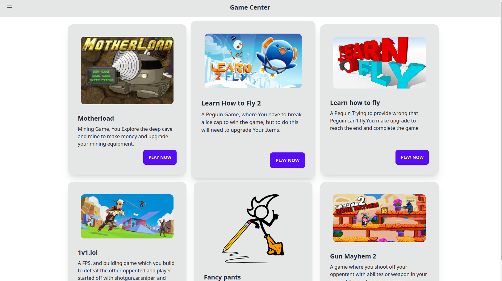

## Requirement
install pnpm:
```bash
$ curl -fsSL https://get.pnpm.io/install.sh | sh -
```
install nodejs:
https://nodejs.org/en/download/package-manager#debian-and-ubuntu-based-linux-distributions<br/>
Debian nodejs sometimes does not work or You can run <p style="background-color:blue;">sudo apt-get install nodejs</p> it might work.
## Deploy

```bash
$ git clone https://github.com/purplebuthole/Game-Center 
$ cd Game-Center
$ pnpm i # or npm i or yarn install or bun install
$ pnpm run dev # or bun run dev
```

## Usage

Those templates dependencies are maintained via [pnpm](https://pnpm.io) via `pnpm up -Lri`.

This is the reason you see a `pnpm-lock.yaml`. That being said, any package manager will work. This file can be safely be removed once you clone a template.

```bash
$ npm install # or pnpm install or yarn install
```

### Learn more on the [Solid Website](https://solidjs.com) and come chat with us on our [Discord](https://discord.com/invite/solidjs)

## Available Scripts

In the project directory, you can run:

### `npm dev` or `npm start`

Runs the app in the development mode.<br>
Open [http://localhost:3000](http://localhost:3000) to view it in the browser.

The page will reload if you make edits.<br>

### `npm run build`

Builds the app for production to the `dist` folder.<br>
It correctly bundles Solid in production mode and optimizes the build for the best performance.

The build is minified and the filenames include the hashes.<br>
Your app is ready to be deployed!

